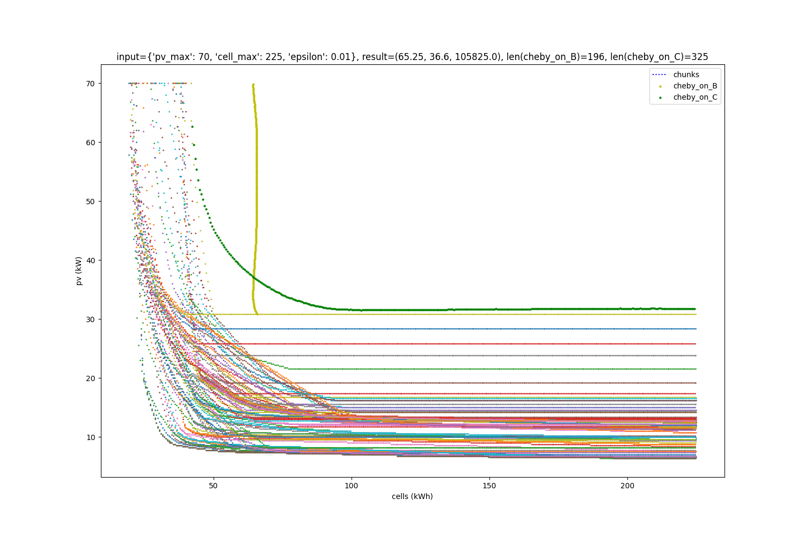

# Robust Sizing Analytics

Generates pictures of simulation curves and Chebyshev curves based on results of several simulations.

## Example

Given input:
```
{
    'binary': './bin/debug/sim',
    'pv_cost': 2000,
    'battery_cost': 500,
    'pv_max': 70,
    'cell_max': 225,
    'metric': 1,
    'epsilon': 0.01
    'conf': 0.95,
    'n_days': 100,
    'load_file': 'example_inputs/load.txt',
    'pv_file': 'example_inputs/pv.txt',
}
```

We have:



## Usage

```bash
python3.7 chebyshev_curve_analytics.py default folder_name

python3.7 chebyshev_curve_analytics.py seattle folder_name

python3.7 chebyshev_curve_analytics.py new_dheli folder_name
```

For the first argument, `default` corresponds to `example_inputs/load|pv.txt`, whereas `{arg}` corresponds to `example_inputs/{arg}_load|pv.txt`.

For the second argument, `{folder_name}` corresponds the output folder name.
